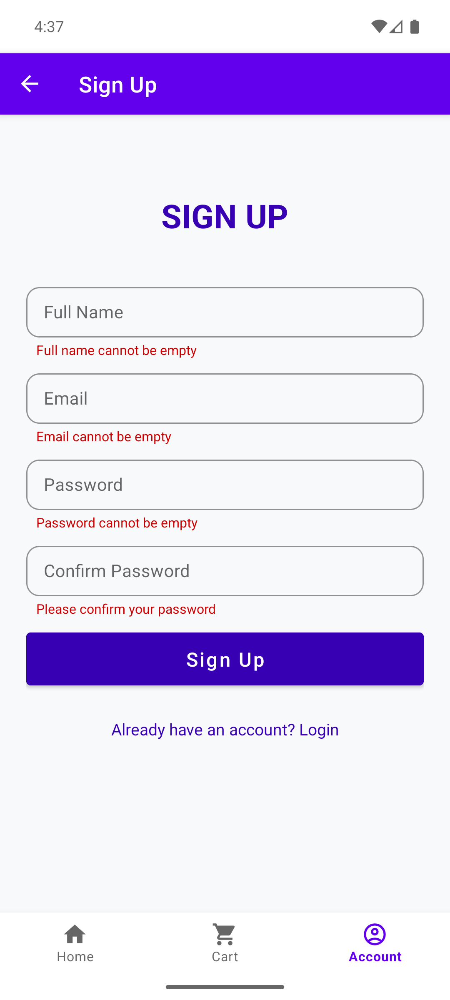
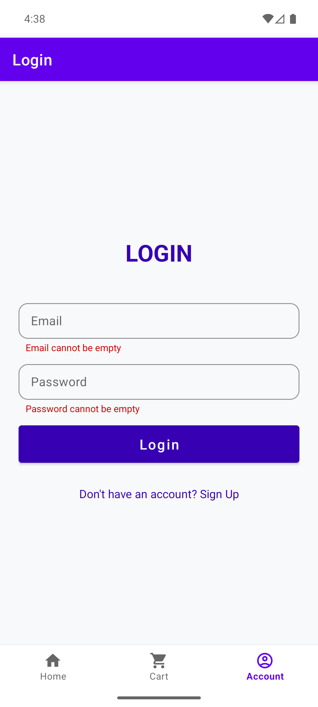
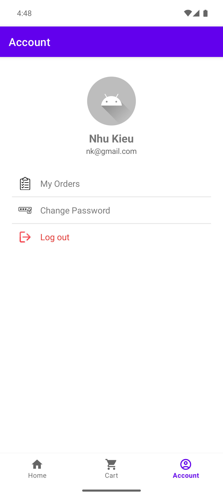
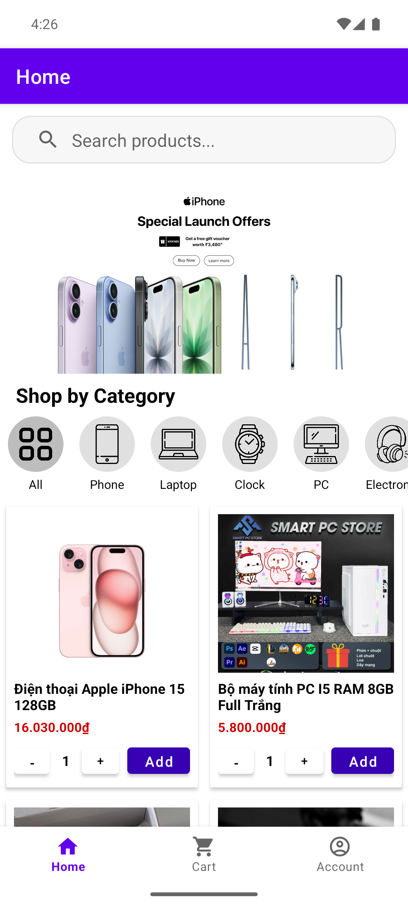
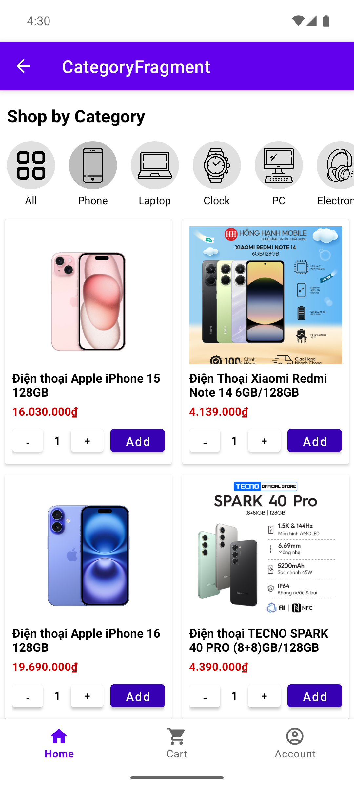
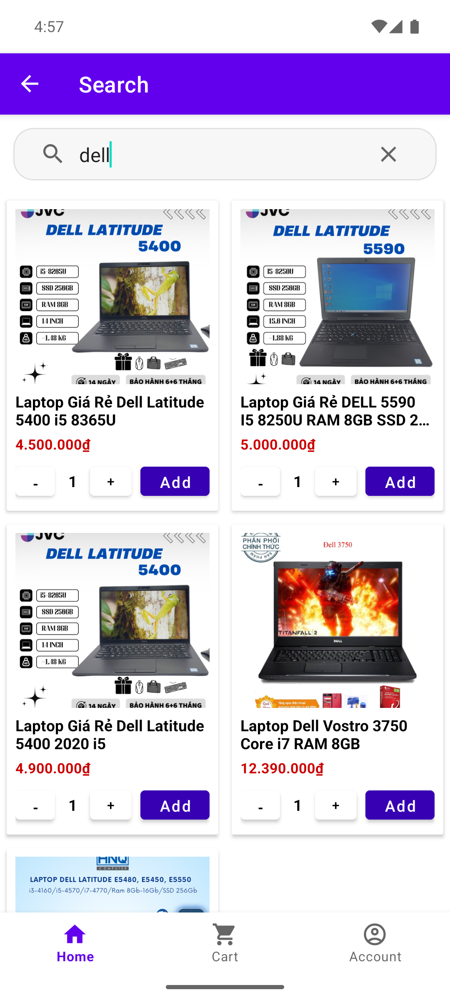
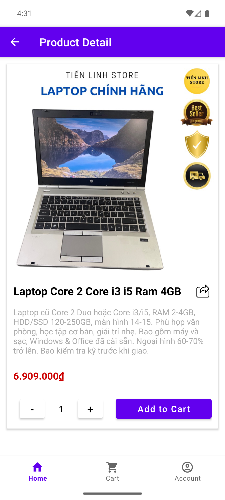
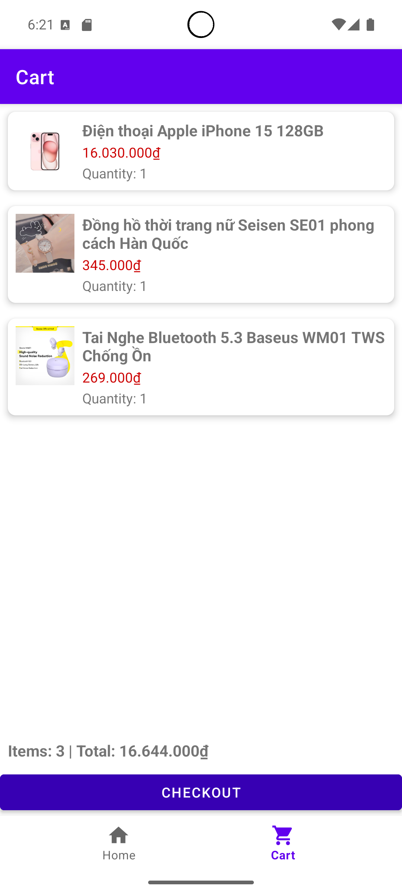
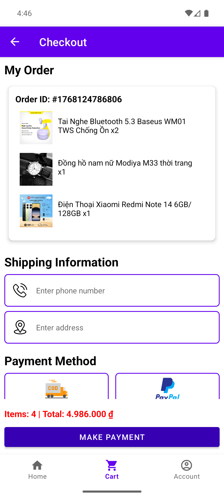
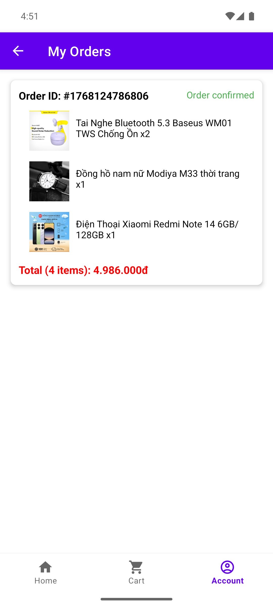

# 🛍️ Online Shopping Application - Shoppingg

## 📘 Introduction

**Shoppingg** is an application that provides users with a wide range of 
**electronic products** such as **mobile phones, laptops, PCs, watches** and **accessories**. The app allows users to search and purchase products easily with a simple interface.

## 🚀 Features
- **Authentication:** Sign Up, Log In and Profile Management.
- **Product Discovery:**  Display all products and search items by name
- **Shopping Flow:**  Product list -> Product Details -> Cart Management -> Checkout
- **Order Management:**  Track and view order history.

## 🧠 Architecture & Tools
- **Language:** Kotlin
- **Architecture:** MVVM (Model-View-ViewModel)
- **UI Framework:** Android Jetpack (ViewModel, Navigation Component)
- **Database:** Room Database (SQLite)
- **UI Components:** RecyclerView, ViewPager2, Material Design, XML Layouts

## 💻 Screenshots

### 🔐 Authentication & Account
| 📝 Sign Up | 🔑 Log In | 👤 Profile Management |
| :---: | :---: | :---: |
|  |  |  |

### 🛍️ Shopping Flow
| 🏠 Home | 📚 Categories | 🔍 Search |
| :---: | :---: | :---: |
|  |  |  |

 

| 📖 Details | 🛒 Cart | 💸 Checkout |
| :---: | :---: | :---: |
|  |  |  |

### 📦 Order History
| 📦 Order List |
| :---: |
|  |
