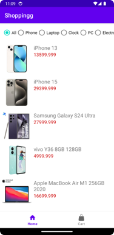
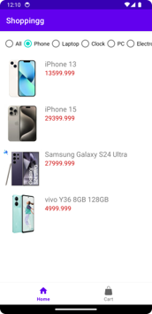
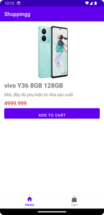
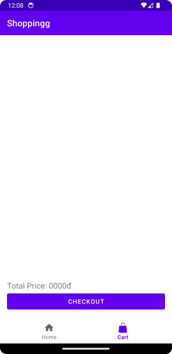
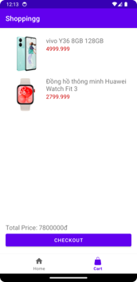

# Ứng dụng mua hàng điện tử Shoppingg

## Giới thiệu về Shoppingg

Shopping là một ứng dụng cung cấp cho người dùng một kho sản phẩm về các
mặt hàng điện tử như điện thoại, laptop, đồng hồ, PC và phụ kiện. 

## Chức năng của Shoppingg

-   Hiển thị tất cả sản phẩm
-   Hiển thị thông tin sản phẩm (Mô tả sản phẩm, giá)
-   Giỏ hàng và thanh toán
-   Phân loại sản phẩm

## Giao diện Shoppingg

#   Danh sách sản phẩm

-   Danh mục sản phẩm

-   Thông tin sản phẩm

-   Giỏ hàng

-   Thanh toán

