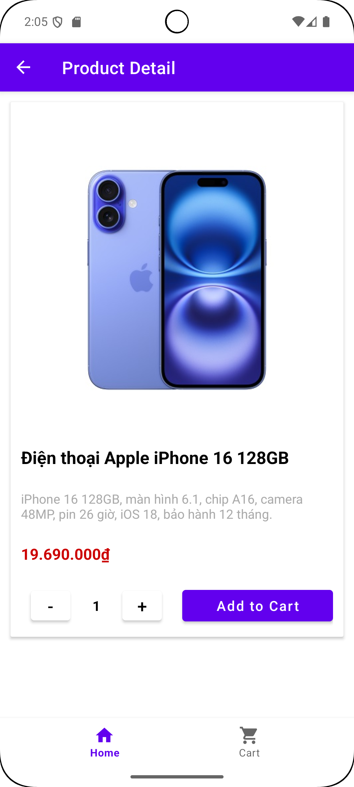

# 🛍️ Online Shopping Application - Shoppingg

## 📘 Introduction

**Shoppingg** is an application that provides users with a wide range of 
**electronic products** such as **mobile phones, laptops, PCs, watches** and **accessories**.  

## 🚀 Features

- Display all products  
- Product categorization 
- Show product information (description, price, etc.)  
- Add to cart and manage selected products  
- Checkout functionality  

## 💻 Screenshots

### 🏷️ Product List

### 📚 Product Categories

### 📖 Product Details

### 🛍️ Shopping Cart

### 💸 Checkout

